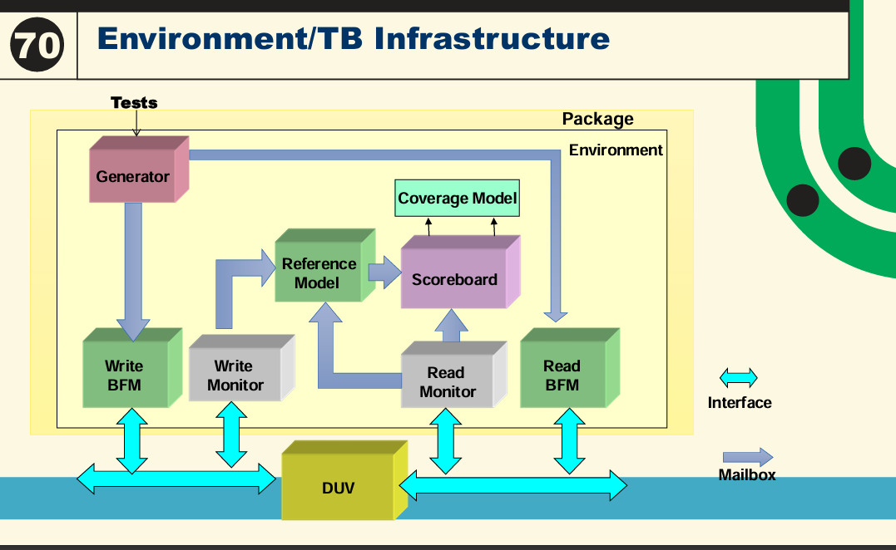

# SV-TB-Verification-Plan
This repository contains a SystemVerilog-based testbench developed for functional verification of digital designs. The testbench includes comprehensive simulation components such as: 
1.Generator.
2.Driver. 
3.Monitor. 
4.Scoreboard. 
5.Reference model.  
6.Environment.
7.Interface.

